# 🚀 AWS EC2 Dockerized Nginx Web Server with Automated S3 Backups

## 📌 Project Overview

This project demonstrates a real-world DevOps setup using AWS services and containerization.

A custom static website is deployed on an Amazon EC2 instance using Docker and the official Nginx image. The project also includes automated backup and restore functionality using Amazon S3, Bash scripting, and cron jobs.

This setup simulates a production-ready environment with security, automation, and disaster recovery.

## 🎯 Objectives

* Launch and configure an EC2 instance (Amazon Linux 2023)
* Secure access using Security Groups
* Install Docker and run containerized applications
* Build and deploy a custom Nginx Docker container
* Host a live website on EC2
* Automate backups to S3 using Bash scripts
* Implement retention policy for old backups
* Restore application data from S3 backups

## 🏗️ Architecture Diagram


## 🧠 How It Works

### Application Flow

1. User accesses EC2 public IP via browser
2. Traffic passes through Security Group (HTTP allowed)
3. EC2 instance runs Docker
4. Docker runs Nginx container
5. Nginx serves the static website

### Backup Flow

1. `backup.sh` compresses website files
2. Uploads backup to S3
3. Applies retention policy (keeps last 5 backups)

### Restore Flow

1. `restore.sh` fetches latest backup from S3
2. Extracts files
3. Restarts Docker container

## 🏗️ Architecture Diagram

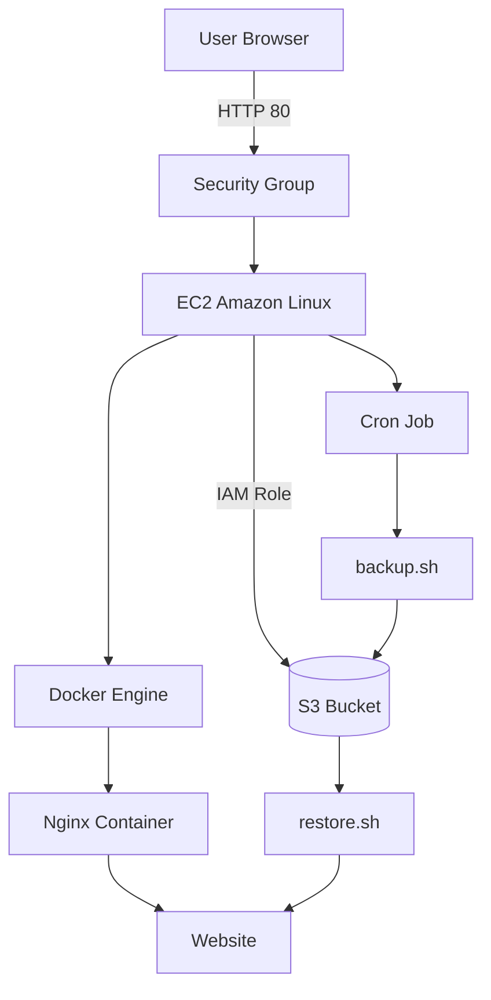

## ⚙️ AWS Services Used

* Amazon EC2
* Amazon S3
* IAM Role
* Security Groups

## 📁 Project Structure

```bash
aws-ec2-docker-nginx-s3-backup/
│
├── app/
│   └── index.html
├── scripts/
│   ├── backup.sh
│   └── restore.sh
├── Dockerfile
├── screenshots/
└── README.md
```

## 🚀 Deployment Steps

### 1. Launch EC2 Instance

* Amazon Linux 2023
* Instance type: t3.micro
* Configure Security Group:

  * HTTP (80) → 0.0.0.0/0
  * HTTPS (443) → 0.0.0.0/0
  * SSH (22) → My IP


### 2. Install Docker

```bash
sudo dnf update -y
sudo dnf install -y docker
sudo systemctl enable docker
sudo systemctl start docker
```

### 3. Create Project Structure

```bash
mkdir -p ~/aws-ec2-docker-nginx-s3-backup/{app,scripts}
cd ~/aws-ec2-docker-nginx-s3-backup
```

### 4. Create Website

```bash
nano app/index.html
```

### 5. Create Dockerfile

```dockerfile
FROM nginx:stable-alpine
COPY app/index.html /usr/share/nginx/html/index.html
EXPOSE 80
```

### 6. Build Docker Image

```bash
sudo docker build -t hashmitech-nginx .
sudo docker ps
```

### 7. Run Container

```bash
sudo docker run -d --name nginx-site -p 80:80 hashmitech-nginx
```

### 8. Access Website

Open in browser:

```
http://13.40.122.255 {MY_PUBLIC_IP}
```

## ☁️ S3 Backup Setup

### 9. Create S3 Bucket

* Bucket name: `hashmi-ec2-backups`

### 10. Attach IAM Role

* Role: `ec2-s3-access-role`
* Policy: `AmazonS3FullAccess`

### 11. Verify AWS Access

```bash
aws sts get-caller-identity
```

## 🔁 Backup Script

```bash
#!/bin/bash

BUCKET="hashmi-ec2-backups"
DATE=$(date +%F-%H-%M)
BACKUP_FILE="backup-$DATE.tar.gz"

tar -czf $BACKUP_FILE ~/aws-ec2-docker-nginx-s3-backup/app

aws s3 cp $BACKUP_FILE s3://$BUCKET/

echo "Backup uploaded: $DATE"

aws s3 ls s3://$BUCKET/ | sort | head -n -5 | awk '{print $4}' | while read file; do
  aws s3 rm s3://$BUCKET/$file
done
```

## 🔄 Restore Script

```bash
#!/bin/bash

BUCKET="hashmi-ec2-backups"

LATEST=$(aws s3 ls s3://$BUCKET/ | sort | tail -n 1 | awk '{print $4}')

aws s3 cp s3://$BUCKET/$LATEST .

tar -xzf $LATEST -C ~/aws-ec2-docker-nginx-s3-backup/

docker restart nginx-site

echo "Restored: $LATEST"
```

## ⏰ Automation (Cron Job)

```bash
crontab -e
```

Add:

```bash
0 2 * * * /home/ec2-user/aws-ec2-docker-nginx-s3-backup/scripts/backup.sh
```

## 📸 Screenshots

### Infrastructure Setup

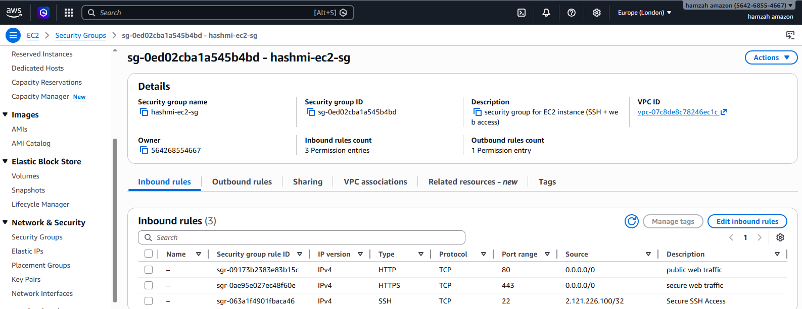
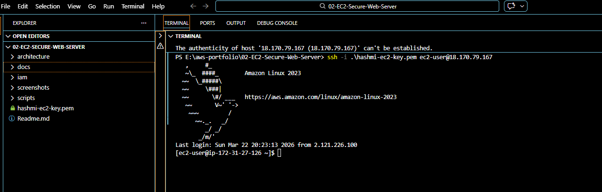
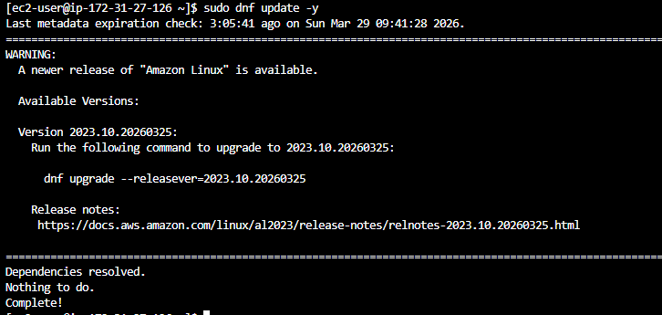

### Docker Setup

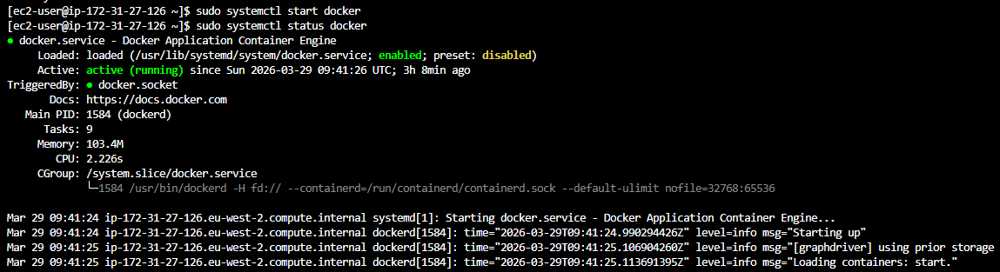
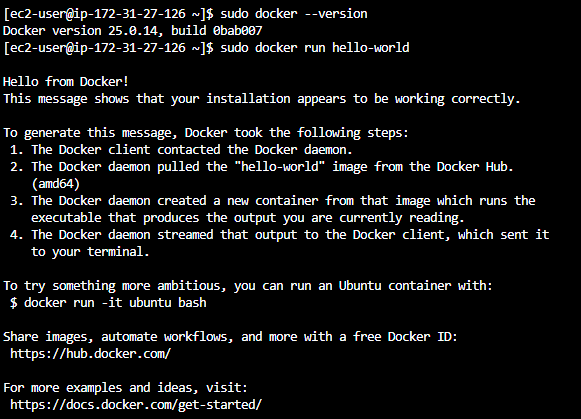

### Project Setup

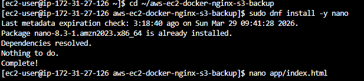
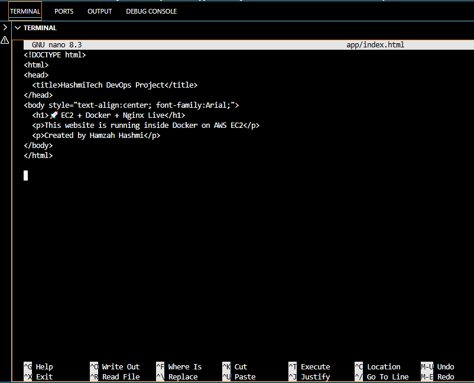
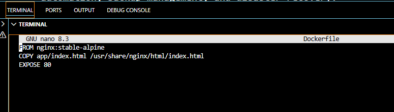

### Container Deployment

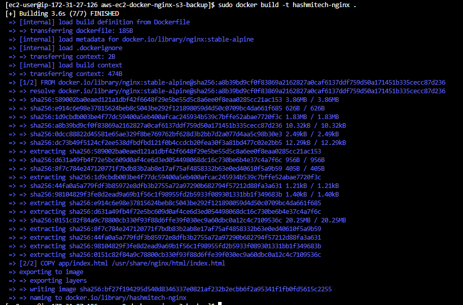
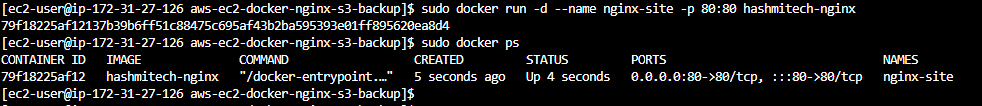
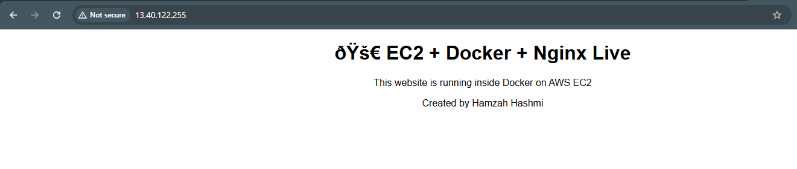

### AWS Integration

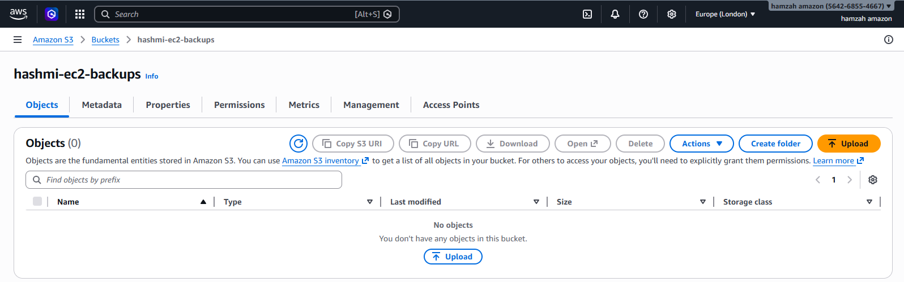
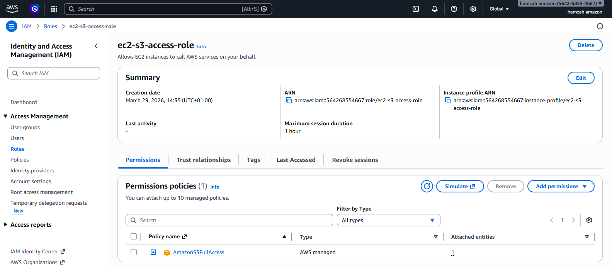
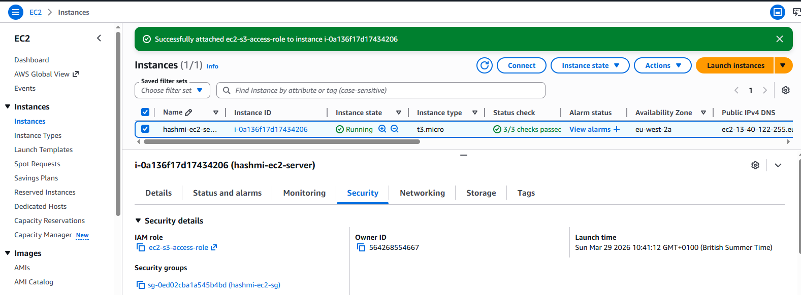
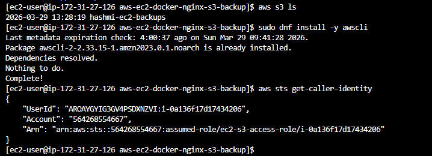

### Backup & Restore

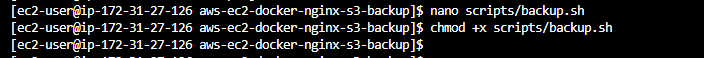
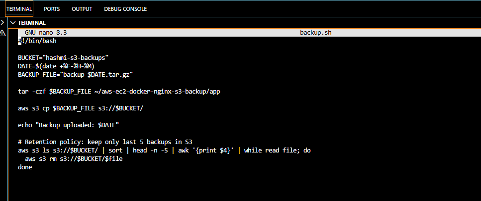
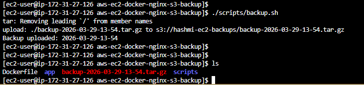
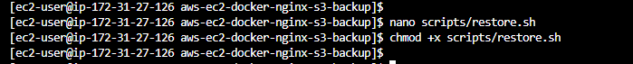
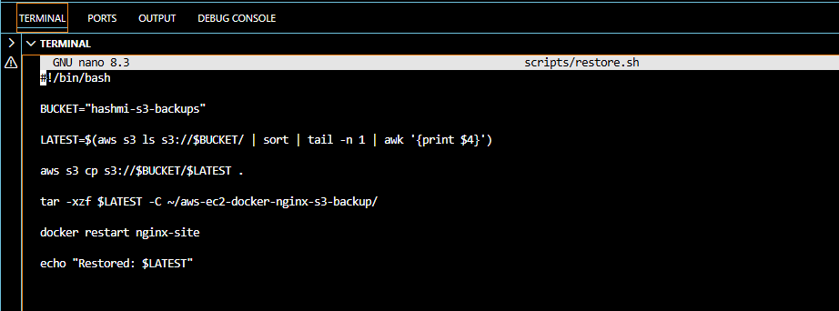

---

## 🔐 Security Best Practices

* SSH restricted to specific IP
* IAM Role used instead of access keys
* S3 bucket private
* No secrets stored in code

---

## 🧠 Key Learnings

* EC2 provisioning and networking
* Docker containerization
* Nginx deployment
* S3 integration
* Automation using cron
* Backup and disaster recovery

---

## 🔮 Future Improvements

* Add HTTPS with Nginx + SSL
* Use Docker Compose
* CI/CD with GitHub Actions
* Infrastructure as Code (Terraform)

---

## 👨‍💻 Author

**Hamzah Hashmi (HashmiTech)**
Aspiring DevOps & Cloud Engineer 🚀

---

## ⭐ Portfolio Value

This project demonstrates hands-on skills in:

* AWS Cloud Infrastructure
* Docker & Containers
* Automation & Scripting
* Backup & Recovery Systems

💯 Ready for DevOps / Cloud Engineer roles
